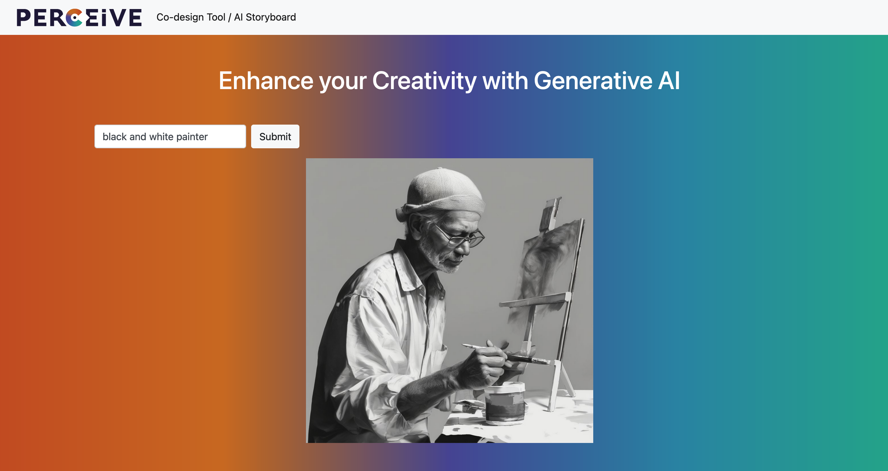

# Flask tutorial for Python projects web deployment

Prototype of a web app for Diffusion based GenAI services

	<code></code>
	<code></code>
    <code></code>
    <code></code>

<u>Preview</u>

## Instructions for the correct use of Terminal

**Creating the Virtual Environment**

To correctly run, the repository needs to be run in a virtual environment and installing in it the `flask` library
1. `python3 -m venv env`
2. `source env/bin/activate`
3. `pip install flask`

**Run the Flask app**

Considering `app.py`:
1. `export FLASK_APP=app`
2. `export FLASK_ENV=development`
3. `flask run`

## Tutorials

- Dyouri, A. (2023) «How To Make a Web Application Using Flask in Python 3», *Digital Ocean*, [link](https://www.digitalocean.com/community/tutorials/how-to-make-a-web-application-using-flask-in-python-3)
- Dyouri, A. (2023) «How To Use Web Forms in a Flask Application», *Digital Ocean*, [link](https://www.digitalocean.com/community/tutorials/how-to-use-web-forms-in-a-flask-application)